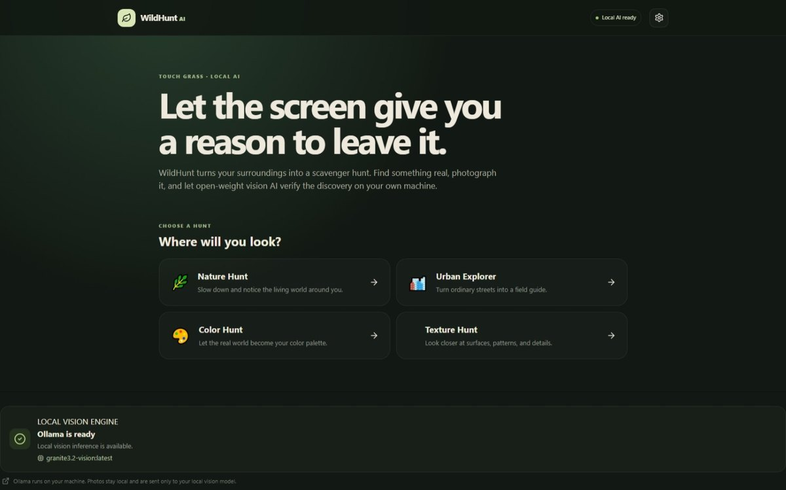
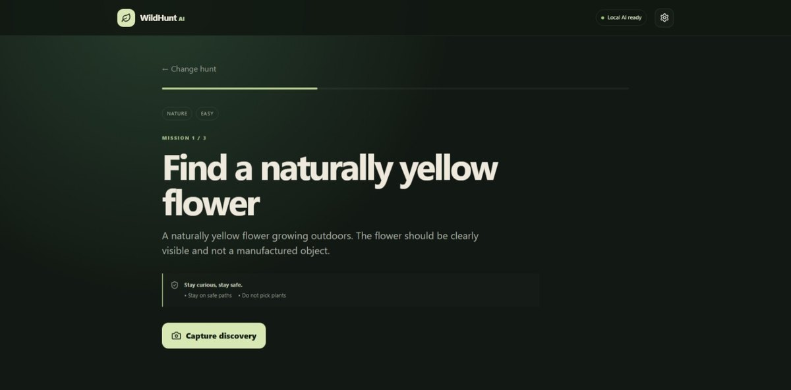
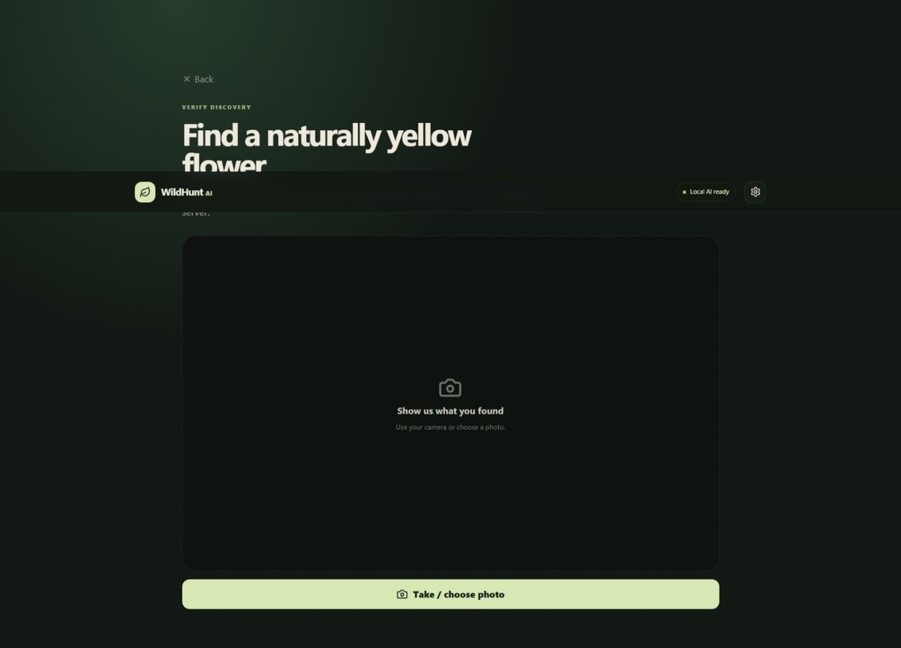
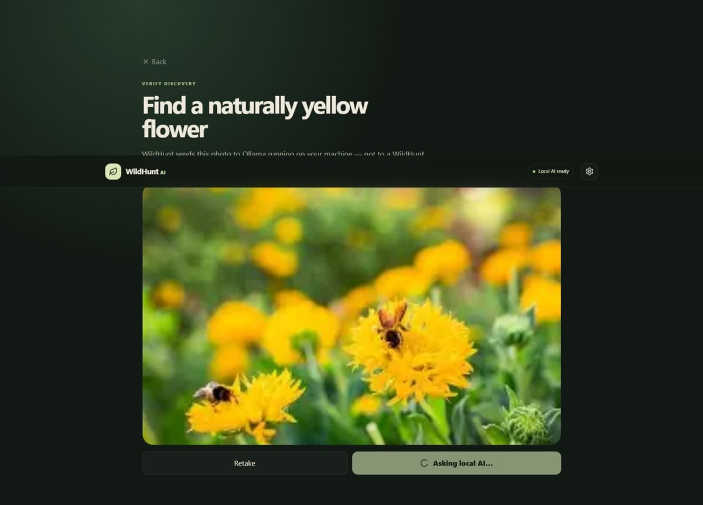
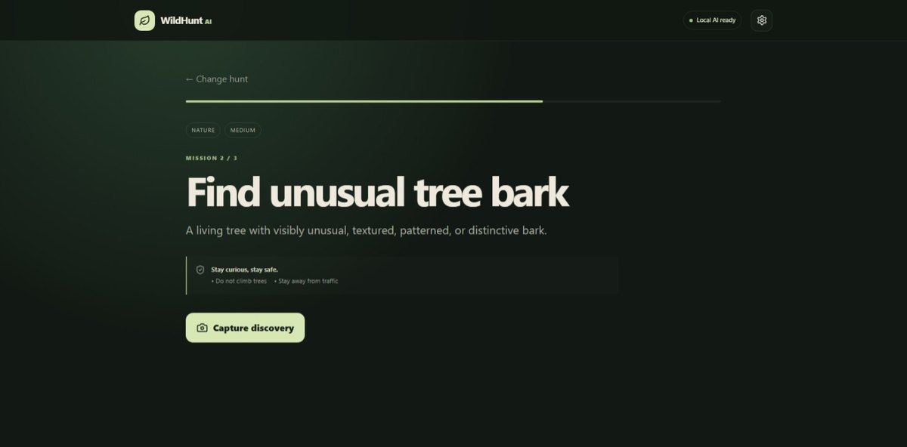
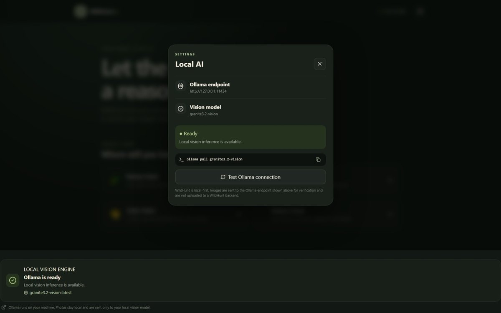

# 🌿 WildHunt AI

> **The screen gives you the mission. The real world gives you the answers.**

[](https://hacktoberfest.com/)
[](https://dev.to/challenges/hacktoberfest-week1-2026-10-05/)
[](https://react.dev/)
[](https://www.typescriptlang.org/)
[](https://ollama.com/)
[](LICENSE)

**WildHunt AI** is a privacy-first outdoor scavenger-hunt PWA that uses **local open-weight vision AI** to turn real-world exploration into an interactive game.

Choose a hunt. Get a mission. Go outside. Photograph your discovery. Your own machine's vision model checks whether the image satisfies the mission — without sending the photo to a WildHunt cloud backend.

<p align="center">
  
</p>

---

## ✦ Why WildHunt?

Most AI products compete for your attention.

**WildHunt uses AI to give your attention back to the physical world.**

The product is intentionally designed around a simple loop:

```text
Choose Hunt
    ↓
Receive Mission
    ↓
Go Outside
    ↓
Find Something Real
    ↓
Take a Photo
    ↓
Local Vision AI Verifies It
    ↓
Discovery Unlocked
    ↓
Next Mission
```

The screen is only the starting point. **The real world is the game board.**

---

## 🎥 Product Walkthrough

WildHunt is designed as a short, focused interaction: receive a safe mission, capture a real-world discovery, and let local vision AI verify it.

### 01 — Receive a mission

<p align="center">
  
</p>

Each hunt gives the player a concrete, observation-based objective with safety guidance. Missions are designed to encourage exploration rather than risky behavior.

### 02 — Capture the discovery

<p align="center">
  
</p>

The player can use their device camera or choose a photo. The image stays in the client until it is sent to the configured vision endpoint.

### 03 — Scan the photo with local AI

<p align="center">
  
</p>

WildHunt sends the image to **Ollama running on the user's machine**, not to a WildHunt server.

### 04 — Mission-specific AI verification

<p align="center">
  
</p>

The vision model is asked whether the photo satisfies **the current mission**, then returns structured evidence, an explanation, and a model-reported confidence score.

### 05 — Local AI settings

<p align="center">
  
</p>

The Settings panel makes the local inference setup transparent: endpoint, active vision model, connection status, and the command needed to install the model.

---

## 🏕️ Hacktoberfest 2026 — Week 1

WildHunt AI was built for **Hacktoberfest 2026 Week 1: “Touch Grass”**, the DEV open-source AI challenge.

The challenge asks builders to create a new project with open-source AI at its core and explore how open innovation can get people away from the screen. WildHunt fits that premise directly: **local vision inference is the mechanism that verifies an offline, real-world activity.**

**Challenge:** Hacktoberfest Open-Source AI Challenge — Week 1  
**Theme:** Touch Grass 🌱  
**Entry window:** October 5–11, 2026  
**Focus:** open-source AI, open-weight models, and/or local inference

Useful challenge links:

- [Hacktoberfest 2026](https://hacktoberfest.com/)
- [Week 1 DEV Challenge](https://dev.to/challenges/hacktoberfest-week1-2026-10-05/)
- [Official Week 1 rules](https://dev.to/page/hacktoberfest-week1-2026-10-05-contest-rules)

---

## 🧠 Local AI Architecture

WildHunt does **not** require a paid AI API.

The browser sends the selected image directly to the user's configured local Ollama endpoint:

```text
React + Vite PWA
       │
       ├── Mission + safety rules
       │
       ├── Camera / image capture
       │
       └── Local AI provider
                │
                ▼
        Ollama HTTP API
        127.0.0.1:11434
                │
                ▼
      granite3.2-vision
                │
                ▼
     Mission-specific JSON
                │
                ▼
           Zod validation
```

### Verification contract

The model is asked a **mission-specific visual question**, rather than performing generic image classification.

Expected output:

```json
{
  "matched": true,
  "confidence": 0.91,
  "evidence": [
    "yellow flower",
    "outdoor vegetation"
  ],
  "explanation": "The image clearly shows a yellow flower outdoors."
}
```

> **Note:** `confidence` is a model-reported score, not a calibrated probability.

---

## 🔐 Privacy by Design

WildHunt is local-first by default.

- 📷 Photos are processed in the browser.
- 🧠 Verification runs through the user's local Ollama instance.
- ☁️ No WildHunt image-upload backend is required.
- 🔑 No hosted AI API key is required.
- 👤 No account is required for the MVP.
- 📊 No analytics SDK or tracking layer is included.
- 🗄️ No cloud image storage is included.
- 🔌 The AI provider is isolated so other local inference providers can be added later.

If a user deliberately configures a remote Ollama endpoint, the privacy characteristics depend on that endpoint.

See [Privacy](docs/privacy.md) and [Security](SECURITY.md).

---

## 🎮 Hunts

WildHunt ships with several structured hunt modes:

| Hunt | Focus |
|---|---|
| 🌿 Nature Hunt | Living things and natural discoveries |
| 🏙️ Urban Explorer | Public art, architecture, and overlooked details |
| 🎨 Color Hunt | Naturally occurring colors and visual clues |
| 🪨 Texture Hunt | Surfaces, patterns, bark, and stones |

Example missions include:

- Find a naturally yellow flower
- Find unusual tree bark
- Find an interesting stone
- Find outdoor artwork
- Notice something you normally walk past
- Find something naturally red
- Find a repeating natural pattern
- Find a public landmark detail

---

## 🛡️ Safety Philosophy

WildHunt is designed around **observation, not risk**.

Mission constraints avoid activities involving:

- roads and traffic
- railway areas
- climbing
- entering water
- private property
- disturbing wildlife
- picking or eating unknown plants
- crossing barriers
- unnecessary physical danger

The AI verifies the mission; it does not replace common sense. Always follow local rules and stay aware of your surroundings.

---

## 🧱 Tech Stack

| Layer | Technology |
|---|---|
| UI | React 18 |
| Language | TypeScript |
| Build | Vite |
| Styling | Custom CSS |
| Icons | Lucide React |
| Validation | Zod |
| Local AI runtime | Ollama |
| Default vision model | `granite3.2-vision` |
| Camera | Browser camera/file capture |
| Persistence | Browser storage |
| PWA | Web manifest + service worker |
| Testing | Vitest |

No paid AI service is required by the runtime.

---

## 🚀 Run Locally

### Prerequisites

Install:

- Node.js
- npm
- Ollama

### 1. Install the vision model

```powershell
ollama pull granite3.2-vision
```

Verify Ollama:

```powershell
Invoke-RestMethod http://127.0.0.1:11434/api/tags
```

You should see `granite3.2-vision` in the returned model list.

### 2. Install dependencies

```powershell
npm install
```

### 3. Validate the project

```powershell
npm run typecheck
npm test -- --run
npm run build
```

### 4. Start WildHunt

```powershell
npm run dev
```

Open:

```text
http://localhost:5173
```

---

## ⚙️ Local AI Configuration

The defaults are:

```text
VITE_OLLAMA_BASE_URL=http://127.0.0.1:11434
VITE_OLLAMA_MODEL=granite3.2-vision
```

To customize them:

```powershell
Copy-Item .env.example .env.local
```

Then edit `.env.local`.

The in-app **Settings** panel shows the active endpoint and model and provides an Ollama connection check.

### Browser → Ollama

If Ollama works from PowerShell but the browser cannot connect, the local Ollama process may need to allow the Vite origin through `OLLAMA_ORIGINS`.

For local development, an example is:

```powershell
$env:OLLAMA_ORIGINS="http://localhost:5173,http://127.0.0.1:5173"
ollama serve
```

Restart Ollama after changing the environment for the running process.

---

## 📁 Project Structure

```text
WildHunt-AI/
├── .github/
│   └── workflows/
├── docs/
│   ├── media/
│   │   ├── dashboard.jpg
│   │   ├── mission-1.jpg
│   │   ├── capture-discovery.jpg
│   │   ├── picture-scanning.jpg
│   │   ├── ollama-verification.jpg
│   │   └── settings.jpg
│   ├── ai.md
│   ├── architecture.md
│   ├── privacy.md
│   └── roadmap.md
├── public/
│   ├── icons/
│   ├── manifest.webmanifest
│   └── sw.js
├── src/
│   ├── components/
│   ├── data/
│   ├── services/
│   │   └── ai/
│   ├── App.tsx
│   ├── main.tsx
│   ├── styles.css
│   └── types.ts
├── .env.example
├── CONTRIBUTING.md
├── LICENSE
├── README.md
├── SECURITY.md
├── package.json
└── vite.config.ts
```

---

## 🧪 Testing

The project includes tests for:

- hunt catalog integrity
- target references
- session progression
- Ollama configuration
- verification schema validation

Run:

```powershell
npm test -- --run
```

## 📜 License

WildHunt AI is released under the **MIT License**.

---

## 🌱 The idea

> **Most AI products compete for your attention. WildHunt uses AI to give your attention back to the physical world.**

**The screen gives you the mission.  
The real world gives you the answers.**
